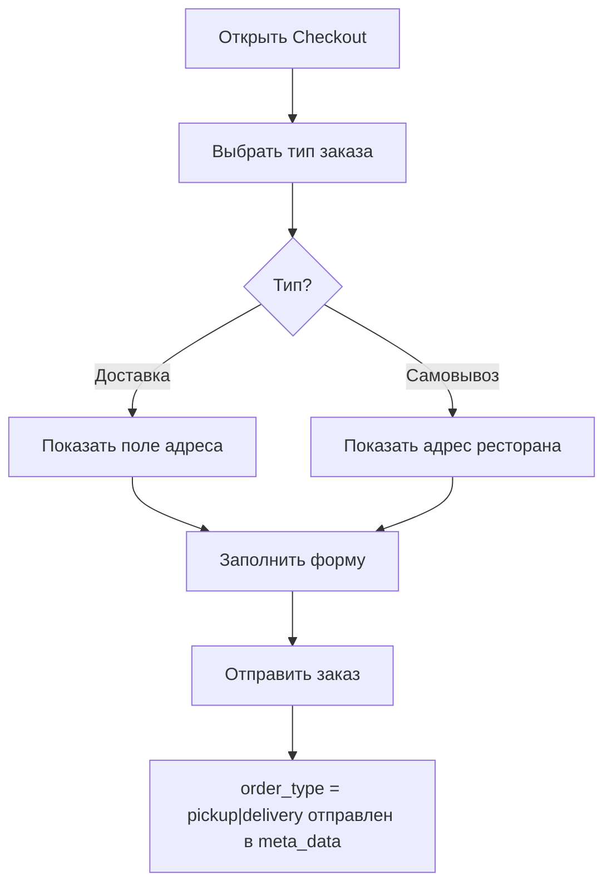
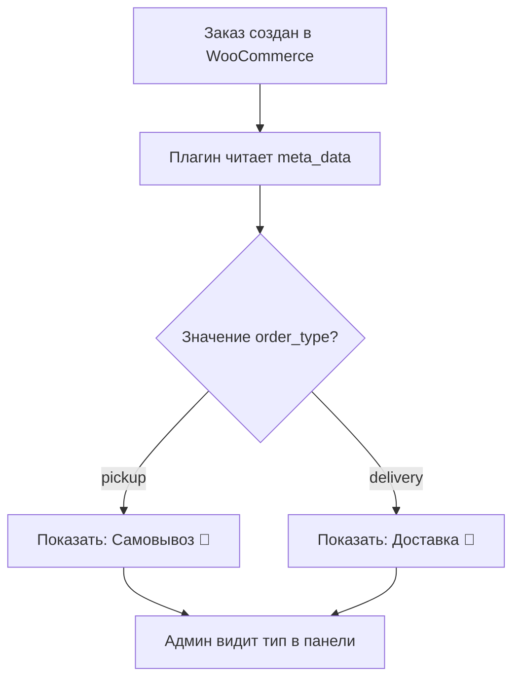

# 🚀 Интеграция функции самовывоза (Pickup)

## ✅ Статус интеграции: Завершено

Функция самовывоза полностью интегрирована в фронтенд и работает с плагином WordPress.

---

## 📋 Что было сделано

### 1. **Фронтенд (React/TypeScript)**

#### **Обновлены компоненты:**

##### ✨ [src/components/Checkout.tsx](src/components/Checkout.tsx)
- ✅ Добавлена константа `RESTAURANT_PICKUP_TEXT` для сообщения о самовывозе
- ✅ Добавлена функция `handleOrderTypeChange()` для переключения между доставкой и самовывозом
- ✅ Улучшено отображение кнопок выбора типа заказа:
  - 🚚 **Доставка** - синяя кнопка
  - 🏪 **Самовывоз** - зеленая кнопка
- ✅ Добавлена информационная панель с адресом ресторана при выборе самовывоза
- ✅ Поле адреса скрывается/показывается в зависимости от выбора типа
- ✅ Валидация формы: адрес требуется только при доставке
- ✅ Тип заказа отправляется в `meta_data` с ключом `order_type`

##### 🎨 [src/components/Dashboard/OrderCard.tsx](src/components/Dashboard/OrderCard.tsx)
- ✅ Добавлены иконки `FaTruck` (доставка) и `FaStore` (самовывоз)
- ✅ Отображается визуальный индикатор типа заказа:
  - 🟦 Синий баннер для "Доставка"
  - 🟩 Зеленый баннер для "Самовывоза"
- ✅ Типы легко различаются в списке заказов администратора

##### 📊 [src/components/Dashboard/OrderDetailsModal.tsx](src/components/Dashboard/OrderDetailsModal.tsx)
- ✅ Добавлена секция "Тип заказа" в детали заказа
- ✅ Четкое отображение:
  - **Для самовывоза:** "Клиент заберет заказ в ресторане" (зеленый)
  - **Для доставки:** "Доставка осуществляется по адресу" (синий)
- ✅ Админ мгновенно видит тип заказа при открытии

##### 📦 [src/types/types.ts](src/types/types.ts)
- ✅ Добавлено поле `meta_data` в тип `Order`:
  ```typescript
  meta_data?: Array<{
    id: number;
    key: string;
    value: string;
  }>;
  ```

---

## 🔄 Как работает процесс

### **Клиент (фронтенд)**



### **Админ (WordPress)**



---

## 💾 Данные, отправляемые на сервер

```json
{
  "status": "on-hold",
  "customer_id": 0,
  "billing": {
    "first_name": "Иван",
    "address_1": "ул. Абдымомунова, 265, Бишкек 720040, Кыргызстан", 
    "phone": "+996123456789",
    "email": "customer_1708437600000@example.com"
  },
  "shipping": {
    "first_name": "Иван",
    "address_1": "ул. Абдымомунова, 265, Бишкек 720040, Кыргызстан"
  },
  "line_items": [...],
  "customer_note": "",
  "total": "1500",
  "currency": "KGS",
  "meta_data": [
    {
      "key": "order_type",
      "value": "pickup"  // или "delivery"
    }
  ]
}
```

---

## 🔌 WordPress плагин

**Файл:** [wordpress-plugins/order-type-display.php](wordpress-plugins/order-type-display.php)

Плагин отображает тип заказа в админ-панели WooCommerce:

```php
<?php
add_action('woocommerce_admin_order_data_after_order_details', function($order){
    $order_type = '';
    foreach ($order->get_meta_data() as $meta) {
        if ($meta->key === 'order_type') {
            $order_type = $meta->value;
            break;
        }
    }

    if ($order_type) {
        $label = $order_type === 'pickup' ? 'Самовывоз' : 'Доставка';
        echo '<p><strong>Тип заказа:</strong> ' . esc_html($label) . '</p>';
    }
});
?>
```

**Результат в админ-панели:**
- ✅ Текст: "Тип заказа: Самовывоз" или "Тип заказа: Доставка"
- ✅ Отображается прямо в деталях заказа

---

## 🎨 Визуальные изменения

### Форма оформления заказа

```
┌─────────────────────────────────────┐
│ 🔙 Оформление заказа | Автозаполнен│
└─────────────────────────────────────┘
                                      
📦 Способ получения *
┌──────────────┬──────────────┐
│ 🚚 Доставка  │ 🏪 Самовывоз │
└──────────────┴──────────────┘
(выбран один из них - подсвечен)

Если выбран "Самовывоз":
┌──────────────────────────────────────┐
│ ✅ Вы сможете забрать ваш заказ в   │
│    нашем ресторане. Адрес указан    │
│    ниже.                              │
│                                       │
│ 📍 Адрес ресторана:                  │
│ ул. Абдымомунова, 265, Бишкек...     │
│ 📞 +996 (312) 62-55-55              │
└──────────────────────────────────────┘
```

### Карточка заказа в Dashboard

```
┌──────────────────────────────────────┐
│ #12345                          1500 │
│ Иван Иванов                          │
│ +996123456789                        │
│                                      │
│ 🏪 Самовывоз    ← Новый индикатор   │
│ 📍 ул. Абдымомунова, 265...          │
│                                      │
│ 👁 Просмотреть детали заказа        │
│                                      │
│ [Кнопки действий]                    │
└──────────────────────────────────────┘
```

### Детали заказа в Modal

```
┌────────────────────────────┐
│ Заказ #12345         [>] [X]
├────────────────────────────┤
│ 👤 Информация о клиенте    │
│ Имя: Иван Иванов          │
│ Телефон: +996123456789    │
│ Дата: 01.01.2024          │
│                            │
│ ✅ Самовывоз              │ ← Новая секция
│ Клиент заберет заказ      │
│ в ресторане               │
│                            │
│ 📍 Адрес                   │
│ ул. Абдымомунова, 265...   │
│                            │
│ [Товары, стоимость...]     │
└────────────────────────────┘
```

---

## 🧪 Тестирование

### Быстрый тест (клиент)

1. ✅ Откройте корзину
2. ✅ Нажмите "Оформить заказ"
3. ✅ Выберите "Доставка" - должно появиться поле адреса
4. ✅ Выберите "Самовывоз" - должна появиться информация о ресторане
5. ✅ Заполните форму и создайте заказ
6. ✅ Проверьте, что `order_type` отправлен в `meta_data`

### Быстрый тест (админ)

1. ✅ Перейдите в WooCommerce → Заказы
2. ✅ Откройте созданный заказ
3. ✅ Должна быть видна строка "Тип заказа: Самовывоз" или "Доставка"
4. ✅ В Dashboard → OrderCard должен быть видим тип (цветной баннер)
5. ✅ В деталях заказа должна быть секция с типом

---

## 📝 Важные детали

### Константы (неизменяемые)

```typescript
const RESTAURANT_ADDRESS = 'ул. Абдымомунова, 265, Бишкек 720040, Кыргызстан';
const RESTAURANT_PHONE = '+996 (312) 62-55-55';
const RESTAURANT_PICKUP_TEXT = 'Вы сможете забрать ваш заказ в нашем ресторане. Адрес указан ниже.';
```

**Где изменять:**
- [src/components/Checkout.tsx](src/components/Checkout.tsx) - поле `const` в начале файла

### Цветовая схема

| Тип | Цвет | Компонент |
|-----|------|-----------|
| Доставка | 🔵 Синий (`bg-blue-600`) | Checkout, OrderCard, OrderDetailsModal |
| Самовывоз | 🟢 Зеленый (`bg-green-600`) | Checkout, OrderCard, OrderDetailsModal |

---

## 🚀 Развертывание

1. ✅ Все изменения готовы к production
2. ✅ Нет опасных операций с БД
3. ✅ Плагин WordPress совместим
4. ✅ Мобильный дизайн адаптирован

**Файлы для развертывания:**
- ✅ `/src/components/Checkout.tsx`
- ✅ `/src/components/Dashboard/OrderCard.tsx`
- ✅ `/src/components/Dashboard/OrderDetailsModal.tsx`
- ✅ `/src/types/types.ts`

---

## 📞 Поддержка

Если что-то не работает:

1. ✅ Проверьте консоль браузера на ошибки
2. ✅ Убедитесь, что плагин активирован в WordPress
3. ✅ Проверьте, что `meta_data` отправляется в API
4. ✅ Очистите кэш браузера (F5 или Ctrl+Shift+R)

---

**Дата завершения:** 20.02.2026
**Версия:** 1.0.0
